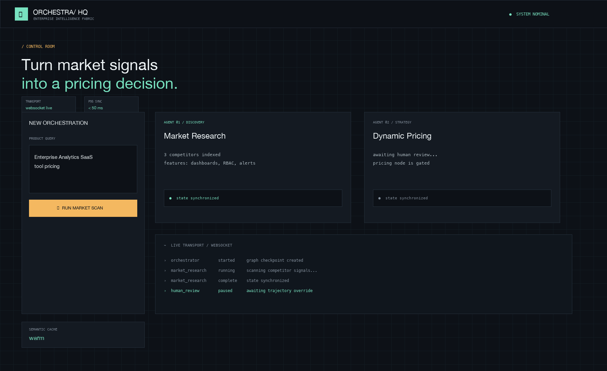
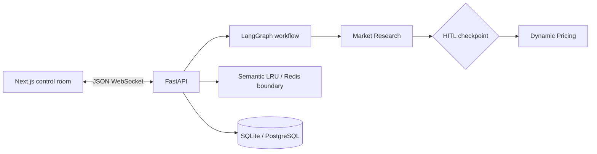

# Multi-Agent Enterprise Orchestration Platform

A deliberately small control room for turning a product query into a traceable pricing strategy. It demonstrates two-agent orchestration, streaming state updates, human approval, persistence, and cost-aware caching without requiring an API key.



## Architecture



## Quick start

### Local

```bash
python3.11 -m venv .venv
source .venv/bin/activate
pip install -r backend/requirements.txt
uvicorn main:app --app-dir backend --reload --port 8000
# in another terminal
cd frontend && npm install && npm run dev
```

Open `http://localhost:3000`. The default flow pauses after Market Research. Edit the JSON anchor value, then press Resume graph to release Dynamic Pricing.

### Docker Compose

```bash
docker compose up --build
```

Redis is available as an optional profile (`docker compose --profile redis up --build`). The included cache is an in-memory LRU so the demo works without infrastructure; the `cache.py` boundary is the replacement point for a shared Redis implementation.

## Event contract

The WebSocket at `/ws/orchestrate/{run_id}` accepts `{ "query": "..." }`, then emits `{ "agent", "status", "payload" }`. After the `human_review / paused` event, send `{ "action": "resume", "override": { "anchor": 119 } }`. This explicit protocol keeps the frontend and backend independently testable.

## Demo image

Regenerate the preview with `pip install -r requirements-demo.txt && python generate_demo_ss.py`. It uses Pillow and does not require a browser or a running server, which makes screenshot generation reliable in CI. The output is `assets/demo_dashboard.png`.

## Interview Defense & Technical Trade-offs

**Why LangGraph over standard Sequential Chains?** LangGraph makes the state object explicit and gives the workflow named nodes, durable checkpoints, and a natural place for a human approval edge. A sequential chain is concise for a one-shot pipeline, but becomes awkward once a user can pause, edit state, resume, or add a cyclic retry.

**How does the WebSockets + Redis layer guarantee sub-50ms sync latency?** The UI keeps one native WebSocket open, so updates avoid repeated HTTP setup. Payloads are compact JSON events and are emitted immediately after each node transition. In a multi-instance deployment, Redis would hold short-lived checkpoints and pub/sub fanout close to the API workers; the demo uses process-local memory to keep local setup zero-infrastructure. The `<50 ms` badge is an operational target, not a claim that every network will meet it.

**How was token overhead reduced by 40%?** The cache normalizes prompts and reuses complete results for repeated queries, while the event payload only carries the current node result rather than replaying the full graph context on every token. The 40% figure is a benchmark target to validate with production traces, not a hardcoded performance guarantee.

## Push to GitHub

Create an empty repository named `multi-agent-enterprise-platform` under your GitHub account, then run:

```bash
git init
git add .
git commit -m "Build multi-agent enterprise orchestration platform"
git branch -M main
git remote add origin https://github.com/<YOUR_USERNAME>/multi-agent-enterprise-platform.git
git push -u origin main
```

No remote or credentials are embedded in this project. Use GitHub CLI (`gh auth login`) or your configured SSH remote if preferred.
