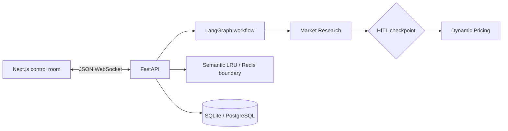

# Multi-Agent Enterprise Orchestration Platform

A deliberately small control room for turning a product query into a traceable pricing strategy. It demonstrates two-agent orchestration, streaming state updates, human approval, persistence, and cost-aware caching without requiring an API key.


## Architecture



## Quick start

### Local

```bash
python3.11 -m venv .venv
source .venv/bin/activate
pip install -r backend/requirements.txt
uvicorn main:app --app-dir backend --reload --port 8000
# in another terminal
cd frontend && npm install && npm run dev
```


